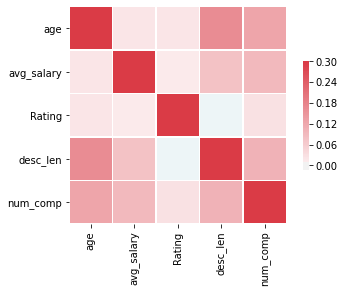

# Data Science Salary Estimator for Data Science Job Positions

* In this project I created a tool that estimates data science salaries with a Mean Average Error of about $14K, in order to help data scientists estimate their salary based on the job description.
* Used data scraping to obtain the dataset from glassdoor job descriptions using python and selenium.
* Engineered features from the text of each job description to quantify the value that each company put on skills such as python, r, spark, aws and excel.
* Built and optimized Linear, Lasso and Random Forest Regressors using GridSearchCV to reach the best parameters for each model.
* Developed a client facing API using Flask

## Code and Resources

**Packages**: Pandas, numpy, sklearn, matplotlib, seaborn, flask, selenium, json, pickle. 
Every package used in this project can be found in the requirements.txt file and can be installed by running: > pip install -r requirements.txt

## Dataset description

Our dataset contains the following entries:
*	Job title
*	Salary Estimate
*	Job Description
*	Rating
*	Company 
*	Location
*	Company Headquarters 
*	Company Size
*	Company Founded Date
*	Type of Ownership 
*	Industry
*	Sector
*	Revenue
*	Competitors 

## Data Cleaning

Right after obtaining the data, I needed to clean it in order to be usable for our prediction model. Hence, the following changes were made:

*	Parsed numeric data out of salary 
*	Parsed rating out of company text 
*	Made a new column for company state 
*	Made columns for employer provided salary and hourly wages 
*	Added a column for if the job was at the company’s headquarters 
*	Transformed founded date into age of company 
*	Made columns for if different skills were listed in the job description, such as:
    * Python  
    * R  
    * Excel  
    * AWS  
    * Spark 
*	Column for simplified job title (analyst, data scientist, machine learning engineer, manager) and Seniority (Senior, Junior or not specified)
*	Column for description length of the job offer 
*	Removed rows without salary 

## Exploratory Data Analysis

In this step I explored the distribution of the data and the value counts for all the categorical variables available. In the following images there are a few highlights obtained from pivot tables.

## Model Building

The first thing done in this process was transforming the categorical variables into dummy variables. Right after that I also split the dataset into train and test sets with a proportion of 80/20.

Three main models were considered and evaluated using MAE (Mean Absolute Error) as a metric. This metric was chosen because it is fairly easy to interpret and outliers aren't as bad for this type of regression model. The models were the following:

* **Multiple Linear Regression** - Baseline model
* **Lasso Regression** - Due to the sparsity of the data from the many categorical variables, I opted for this normalized regression as I thought it would be effective.
* **Random Forest Regressor** - This one was chosen due to the sparse data, like the last one.

##  Production

The last step of this project was to build a Flask API endpoint that was hosted on a local webserver. The API takes in a request with a list of values from a job listing and returns an estimated salary for that particular entry.

## Acknowledgements

* [Data Scraping with Selenium](https://towardsdatascience.com/selenium-tutorial-scraping-glassdoor-com-in-10-minutes-3d0915c6d905)
* [Flask Productionization](https://towardsdatascience.com/productionize-a-machine-learning-model-with-flask-and-heroku-8201260503d2)
